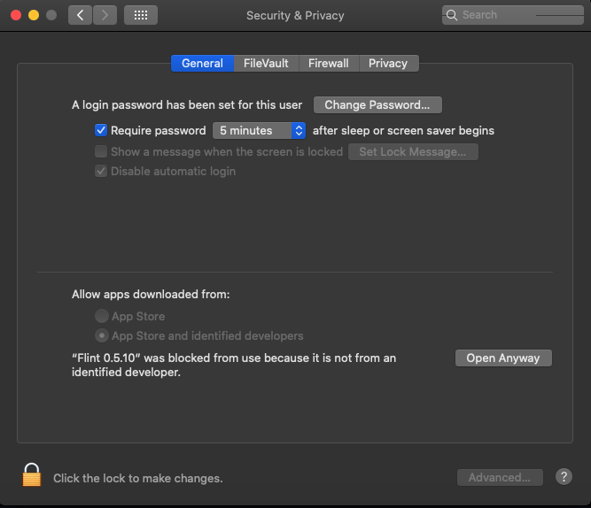
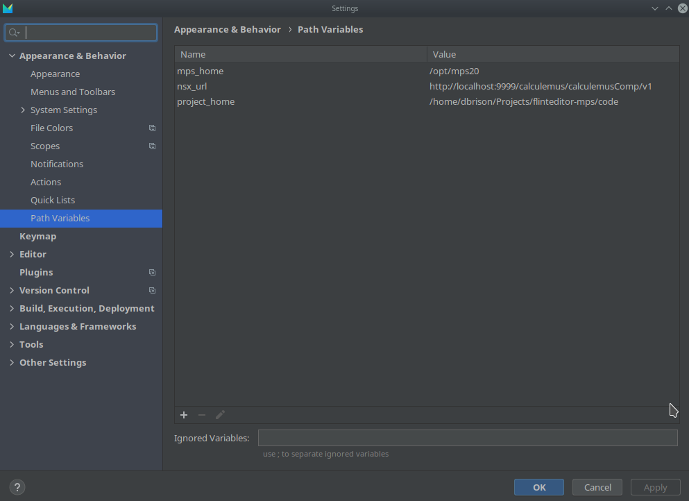

# FLINT-editor MPS

This is an experimental project exploring the viability of a visual FLINT editor based on [MPS](https://www.jetbrains.com/mps/)
## Development
1. Install Java 11
2. Clone the repository
3. Run `gradlew initProject`
4. Start the ide for your specific platform. The executables are locatied in `build/mps/bin`

## Flint IDE
Complete IDE with all required plugins and custom branding.
 
### Build
To build the FlintIDE run `gradlew buildFlintIde`. This will generate compressed artifacts in `code/build/artifacts/FlintIdeDistribution`.

### Install
Download the latest IDE [release](https://github.com/discipl/flinteditor-mps/releases) for your OS.

#### Windows
The Windows asset is `flint-win-ide.zip`. Download and extract the zip. To start the IDE run `%INSTALLATION_FOLDER%/bin/flint.bat`.

#### Linux
he Linux asset is `flint-linux-ide.tar.gz`. Download and extract the tar (the command to extract a tar is `tar -xf flint-linux-ide.tar.gz`). To start the IDE run `%INSTALLATION_FOLDER%/bin/flint.sh`.

#### MacOS
The MacOS asset is `flint-macos-ide.zip`. Download and extract the zip. To start the IDE run `Flint %Version%.app`. 

If you get a popup blocking the startup because of unknown developer. 
 - Search for `Security & Privacy` in Finder.
 - Click the `Open Anyway` button.    

## Flint Plugin
MPS IDE, FlintPlugin and dependant plugins must be manually installed. 
### Build
To build the FlintIDE run `gradlew buildFlintPlugin`. This will generate a zip in `code/build/artifacts/FlintPluginDistribution/`.

### Install
1. Download and install mps 2020.3 from [here](https://www.jetbrains.com/mps/download/previous.html)
2. Download the [mbeddr platform distribution plugins zip](https://projects.itemis.de/nexus/content/repositories/mbeddr/com/mbeddr/platform/2020.3.22810.b4ed033/platform-2020.3.22810.b4ed033.zip)	
3. Extract the files and folders from the com.mbeddr.platform directory in mbeddr platform-distribution.zip file to the plugins folder in your mps installation.
   - On linux  (`~/.MPS2020.3/config/plugins`)
   - On macos  (`~/Library/Application Support/MPS2020.3/` or `$MPS_HOME/plugins`)
   - On windows  (`C:\Users\%USER%\.MPS2020.3\config\plugins`)
4. To install or update your flint plugin follow [this guide](docs/PLUGIN_UPDATE_GUIDE.md). 

### Running NSX server
The editor uses http://calculemus-app.d3e4884570654486a16f.westeurope.aksapp.io/calculemus/calculemusComp/v1 as the default nsx url.
To Specify a different url add a Path Variable called nsx_url to the editor. 

You can run your own version of the nsx layer by starting the docker-compose.yml file in https://ci.tno.nl/gitlab/calculemus/nsx-calculemus. Run 
`docker-compose up -D` after cloning the project.

## Using Flint-mps
A user guide is available [here](docs/USER_GUIDE.md)
