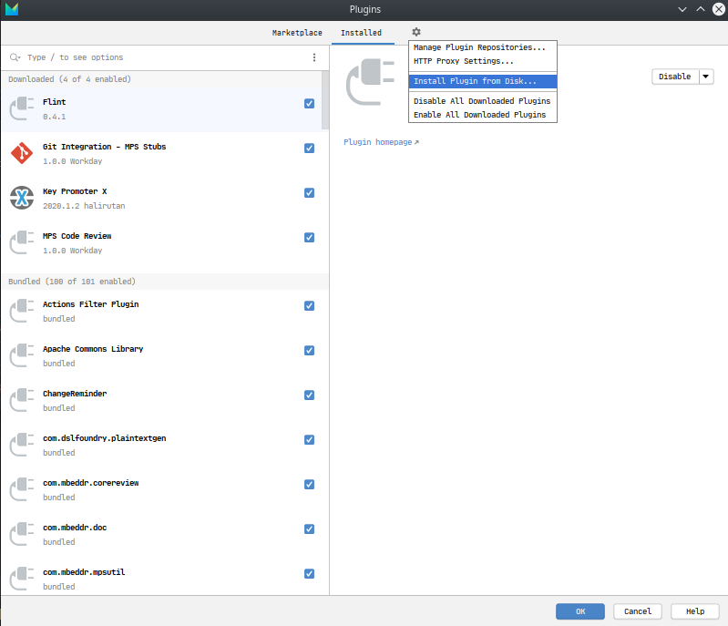

# Plugin Update Guide
To update the flint plugin follow these steps:
- Download the plugin zip.
- Open MPS
- Open the plugin configuration menu   
  `Configure > Plugins`    
  
- Click on the cog and select `Install Plugin from disk...`.
  
- Select de plugin zip file from the file selector.
- Restart MPS and the plugin should be installed and ready.
