# Flint IDE User Guide  
This is the MPS Flint IDE user guide. The Guide covers the following topics.
- [Creating a Flint project](#creating-a-flint-project)
- [Import existing flint model](#optional-import-existing-flint-model)
- [Creating a Flint project](#creating-a-flint-project)
- [Editing a FlintModel](#editing-a-flintModel)
- [Creating a FlintRunner](#creating-a-flintrunner)
- [Using LawText](#law-texts)
- [Using languages and translations](#translations-guide)
- [Archiving acts / facts / duties](#archiving-or-reinstating-act--fact--duty)
- [Marking acts / facts / duties with an interpretation status](#marking-act--fact--duty-as-verified-validated-or-publicized)
- [Creating versions of acts / facts / duties](#creating-versions-of-an-act--fact--duty)
- [Useful Shortcuts, Tips And Tricks](#useful-shortcuts-tips-and-tricks)

## Creating a Flint project
1. Open MPS.
1. Click on Create new project.
1. Select Flint from the menu and fill in the project, solution and model names and hit OK.    

## [Optional] Import existing flint model
1. Right click on the solution folder solution and select "Import FlintModel from Json".  

1. Select the flint model json file and hit ok.
1. If the model folder says generation required. In the top bar click `Build > Make Project`. If you get a menu asking you to review errors select the `Ignore Errors` option.  

## [Optional] Import from Wetten.nl
1. Right click on the solution folder and select "Import FlintModel from Wetten.nl". 

1. Enter a juriconnect (for example jci1.3:c:BWBR0011823&hoofdstuk=3&afdeling=4&paragraaf=1&artikel=30b&lid=1&o=k&z=2019-02-27&g=2019-02-27
)  in the dialog and hit OK.

## [Optional] Use the FlintView
1. Left click on the "Logical View"
1. Select "FlintView" from the dropdown menu  

## Editing a FlintModel
1. Open the created FlintModel using the navigation menu.  

### Acts
1. To create an act right click on the acts or model folder and select Act.   

1. Replace the first <no name> with the name of the act.

#### Quick create new fact
1. Click on the area with <no fact> and enter the name of the fact.
1. Hit `Ctrl+Space` and select Create Fact: (factname).  

#### Select existing fact
1. Click on the area with <no name>.
1. Hit `Ctrl+Space`  and start typing the name of the fact until it's visible in the list.
1. Select the fact.   

#### Preconditions
See [expressions](#expressions).

#### Create & Terminate
For create and terminate you can select a fact or a duty the same way you [selected a fact](#select-existing-fact).

#### Act Sources
1. Create a source. See [sources](#sources).
1. To create a source reference click on the area with << ... >> and hit `Ctrl+Space` and select source or select the empty space under an existing source reference and hit `Enter`.  
1. Under name select the name of the source you would like to reference.
1. Under text enter the text from the source.

### Facts
1. To create a fact right click on the facts or model folder and select Fact.

1. Replace the first <no name> with the name of the fact.

#### Function
See [expressions](#expressions).

#### Fact Sources
1. Create a source. See [sources](#sources).
1. To create a source reference click on the area with << ... >> and hit `Ctrl+Space` and select source or select the empty space under an existing source reference and hit `Enter`.  
1. Under name select the name of the source you would like to reference.
1. Under text enter the text from the source.

### Source Tagging
1. Select the words you want to tag.
1. Hit `Alt+Enter`.
1. Select 'Tag as X'.

   
### Removing source tag
1. Select the words you want to untag.
1. Hit `Alt+Enter`.
1. Select 'Remove X tag'.

### Duties
1. To create a duties right click on the acts or model folder and select Duty.

1. Replace the first <no name> with the name of the duty.
1. You can create and select facts and acts just like in [acts](#acts)

### Sources
1. To create a source right click on the sources or model folder and select Source.

1. Replace the first <no name> with the name of the source.
1. Enter the juriconnect URI.
1. Enter the valid from and valid to dates. These can be entered manually in the dd-mm-yyyy format or by using the date picker by clicking the calendar icon.

You can open the juriconnect on wetten.nl by `Ctrl+Clicking` on the juriconnect.

### Expressions
There are different types of expressions. Creating these expressions with be explained below. To replace an expression hit `Alt+Enter` and select replace (expression x) with (expression y). To nest an expression hit `Alt+Enter` and select wrap (expression x) with new expression. 

### Explanation
You can add or remove an explanation from a act, duty, fact or source usage by hitting `Alt+Enter` and selecting Add or Remove Explanation`.

#### Fact reference
This is just a reference to a fact. You can [create](#create-new-fact) and [select](#select-existing-fact) these just like in acts and duties.
  

#### Multi expression
A multi expression has a list of expressions called operands. A multi expression cannot be converted to a single expression if it has more than one operand.
The following expressions are multi expressions:
- AND
- EQUAL 
- OR 
- MIN 
- MAX
- LESS_THAN
- SUM
- PRODUCT
- CREATE

To create a multi expression:
1. Hit `Ctrl+Space` and select the multi expression from the list.
1. Select the <no fact> area and input a operand which is also an expression.
1.  To add an extra operand you can use one of the following methods: 
    - To add an extra operand to the current multi expression select the expression's keyword (for example AND) and hit `Enter`.
    - To add an extra operand to the parent expression of the currently selected expression hit `Ctrl+Enter`.

#### Single expression 
A single expression has a single expression called operand. NOT is a single expression.

To create a single expression:
1. Hit `Ctrl+Space` and select a single expression from the list.
1. Select the <no name> area and enter the operand which is also an expression.

#### LITERAL expression
A LITERAL expression has a literal value called operand.
The value can be one of the following types:
- Boolean (true/false)
- String (text)
- Number  

To create a LITERAL expression:
1. Hit `Ctrl+Space` and select LITERAL from the list.
1. Select the <no value> area.
1. Hit `Ctrl+Space` and select the literal type.
1. Input the value.

To switch literal move the cursor to the literal value and hit `Alt+Enter` and select replace (type x) value with (type y).

#### LIST expression  
A LIST expression has a single expression called items and has a name property.
To create a LIST expression:
1. Hit `Ctrl+Space` and select LIST from the list.
1. Select the first <no name> area and enter the name of the list.
1. Select the second <no name> area and enter the items which is also an expression.

#### PROJECTION expression  
A PROJECTION expression has a reference to a fact with a CREATE expression called context and a reference to one of the operands of the CREATE expression that you want the value of called fact.
To create a PROJECTION expression:
1. Hit `Ctrl+Space` and select PROJECTION from the list.
1. Select the first <no fact> area, hit `Ctrl+Space` and select the CREATE expression fact.
1. Select the second <no fact> area, hit `Ctrl+Space` and select the operand of the CREATE expression that you want to project.

## Creating a FlintRunner
To create a FlintRunner:
1. right click on the flint folder with an `M` symbol and select `New > FlintModelRunner`.

1. Replace the first <no name> are with the name of the FlintRunner.
1. Select the area with <no flintModel>.
1. Hit `Ctrl+Space` and select the flint model you would like to run from the list.
1. Create actors as specified in [Actor](#actor).
1. Select the activeActors. These are the one or two actors the will be active by default in the runner menu.
1. Select the generalFacts. These are facts that apply to all actors.

To run the FlintModelRunner. 
1. Ensure the project has been built without errors. On the top bar select `Build > Make Project`.
1. Right click somewhere in the FlintModelRunner and select `Run FlintModel` from the list. A Window will open up on the right side where you can test your flint model.

### Actor
1. Create an actor by selecting the <<...>> area under actors:, hitting `Ctrl+Space` and selecting actor.

1. Under facts: you specify the facts that apply to this actor.

## Law Texts
You can import a law text to simplify making flint models.

### Importing
To import a law text:
1. Select a parser from the Publication Parser Selector panel.   

2. `Right Click` the model and create a new `LawSource`.     

3. Input the BWB code for the law text you wish to import.   

4. Click the `Refresh` button. The name of the law text and the available versions will be loaded in.

5. You can navigate to one of the version with `Ctrl+Click`.

6. Hit the `Refresh` button to load in the articles or hit the `FlintFiller` button to run the flint filler for this version.
    - You can navigate to an article with `Ctrl+Click`.
    
### Create Act/Duty/Fact From Law Text
To create an act from law text:
1. Select the model you would like to create the Act/Duty/Fact in from the Current Model Selector panel.    

2. Select the text that your act is in.
3. Hit `Alt+Enter` or `Right Click > Article Actions` and select `Create {Act/Duty/Fact} from Selected Text`.

### Splitting a LawText sentence. 
To split a sentence:
1. Place the cursor where you would like to split the sentence. 
2. Hit `Alt+Enter` and select `Split Line`.   
 
You can also select `Add Text to Existing Node` to add the source to an existing Act/Duty/Fact.

## Translations guide

It is possible to make translations in the FlintEditor. It starts with making a language node in which you must translate all the editor components to your desired language. When activated all the editor components will use the given translation. Building upon this language node a user can also start making translations of Acts/Facts/Duties as they please. To allow for collaboration and sharing information different export options are provided. A user can export/import a language node to share with collaborators or he can export/import a whole FlintModel with a certain translation. A step by step guide will be given below describing each part of the translation process.

### Creating language node
1. Create a new language node  
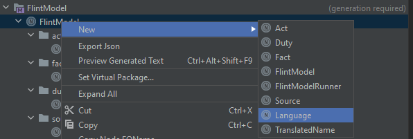
2. You can find your langauge node in the language map as shown below  
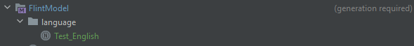
3. The new language node will look empty like the image below. Fill in your translations.   
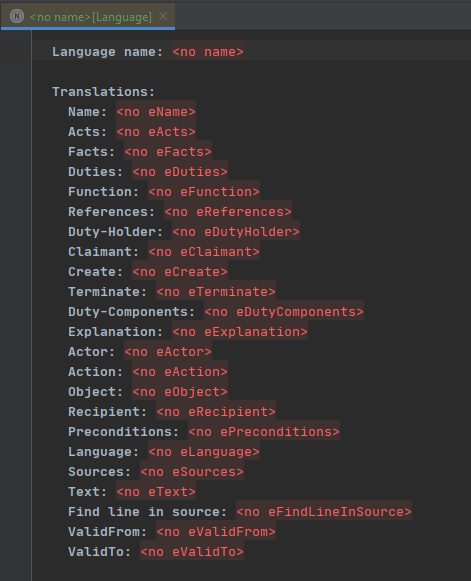
4. In this short guide we will copy the English translation and call it Test_English  
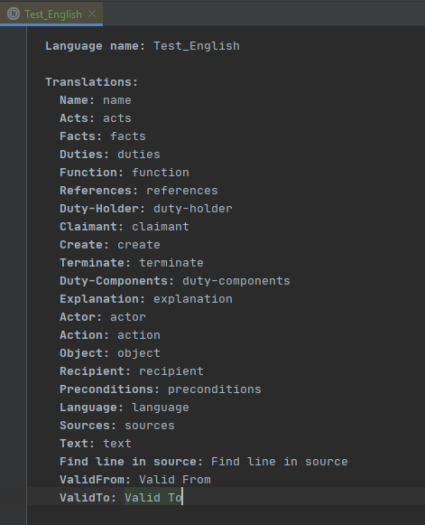

### Importing / Exporting language nodes

- Exporting Language can be done via the "Export json" action which will show after right-clicking the language node.
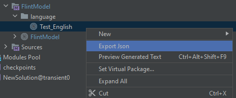
- Importing a Language can be done via the "Import language" action which will show after right-clicking the model map. It requires the abovementioned exported json.
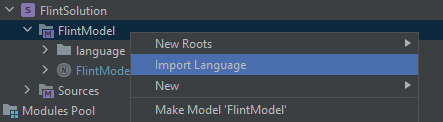

### Selecting a language
- `ctrl+space` click on the language in the FlintModel to see all available languages and select a language to switch it. We will use the Test_English language here. Dutch and English language nodes are provided with Flint. When no language is selected it will default to English.   
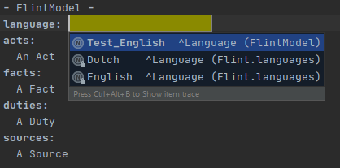

### Translate Acts / Facts / Duties
This guide will demonstrate creating Translations with an Act.

1 . Provided we didn't select a language yet, the default language is English. The Act should look as below.  
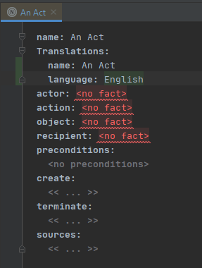  
2 (Manually). We could manually create new translations by pressing `enter` after "English". You can manually fill the language name and translated name. 
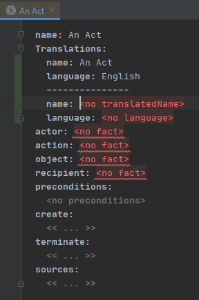    
2 (Automatically). We could also switch the FlintModel language to "Test_English". This will create a new translation with the new language name automatically filled. After we change the translated name of the act we get the next image.     
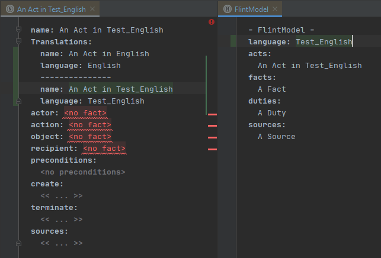   
3 . We can also collide or expand the "Translations" to make the Act more readable as shown below.  
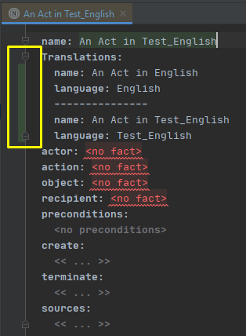
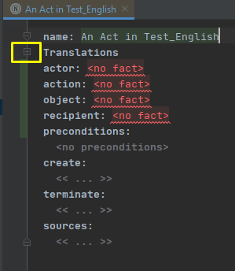   

## Archiving or Reinstating act / fact / duty

Users might encouter a case in which they need to store a node for future reference but don't want that node to have an active role in the model. In this case the user might want to archive such a node. Archived nodes cannot have references or be referenced in the active model, they can however be viewed and edited. Using a node in an active model when it is archived will result in a visible error for the user. If a user wants the archived node to play an active role in the model they can reinstate the node again, making it part of the active model. To archive a node follow these steps:

1. Click on the node you want to archive and open the inspector panel in the bottom-right corner
2. Locate the "Archive" button and click it  
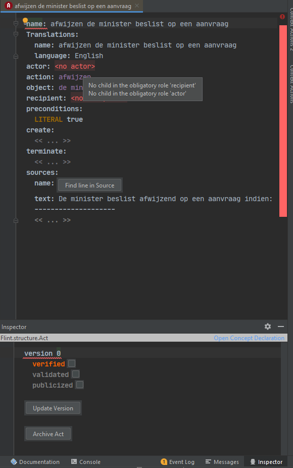   
3. The node will be transfered to an "archived nodes" folder  
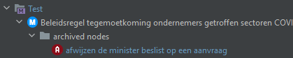     
  
To reinstate the node the user must repeat the abovementioned steps and click on the "Reinstate" button  

## Marking act / fact / duty as verified, validated or publicized

While making interpretations a user might want to mark a specific act / fact / duty as verified, validated or publicized. This feature makes it possible to add these marks but only in a specific order. The panel to add these marks can be opened by clicking on the node and opening the inspector. As shown in the image below, a node must first be marked as verified before it can be marked as validated and so on. This is indicated by the grayed out text, visualy telling the user that this mark cannot yet be given.  

- Location of the verified, validated and publicized marks  
   
- The progression of the marks   
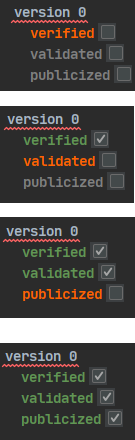  

## Creating versions of an act / fact / duty

While interpreting a user might want to track how a certain act / fact / duty came to its current state. For this purpose it is possible to track the versions an act / fact / duty went through. Via a button which is located in the inspector of an act / fact / duty the user can update the version of the respective node, effectively making the edits persistent so they can be revisted at a later date. These versions are stored, making it possible for the user to click on the dropdown list and browse the previous versions.

It is important to note that while a node can be edited when it shows a specific version, these edits are transient and will not be stored or used to adjust the latest version of the node. The workings of this functionality will be described below.  

1. To update the version click on the node and open the inspector window. Here we can see the current version of the node and the update button to make a new one.  
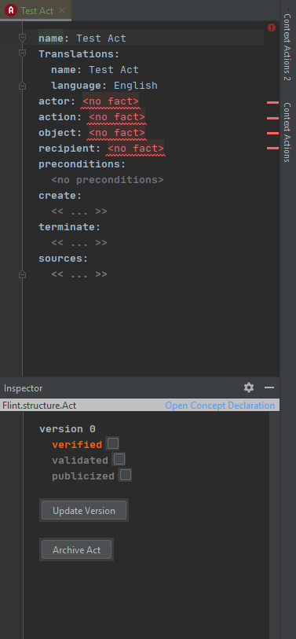   
2. We will update the version in this state by clicking the update version button, storing a snapshot of the state of thecurrent node.   
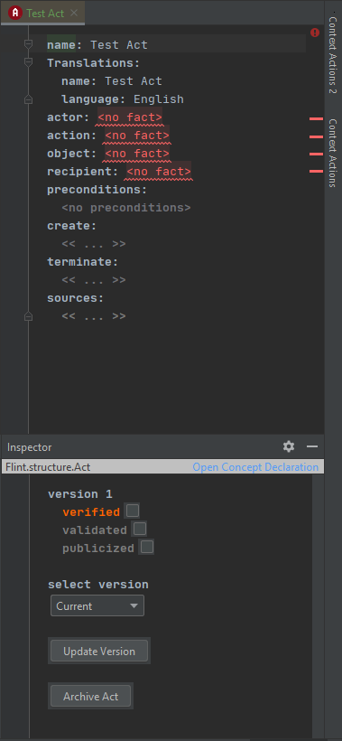   
3. Now we will fill in the actor, action and object with test instances and update again.  
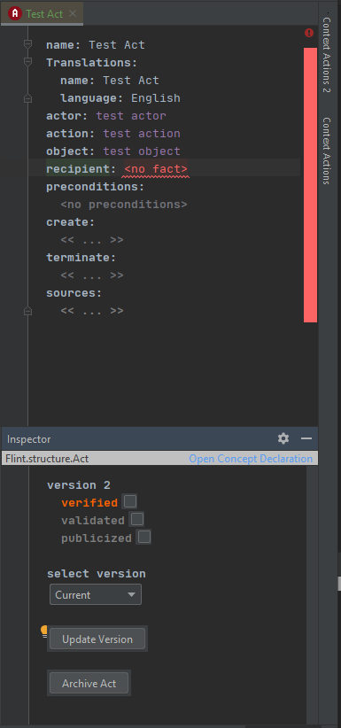   
4. Lastly we will fill in a test recipient, a test source and change the name  
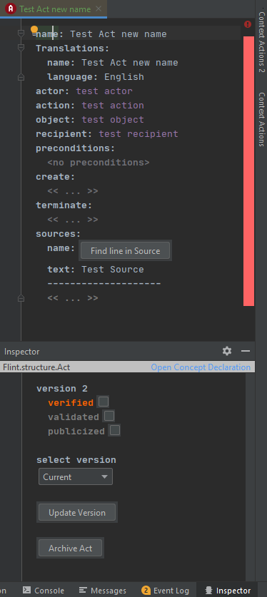    

We have now succesfully made different version and stored them, a user can view the older versions by clicking the "select version" button and clicking the desired version. To go back to the latest edtiable version the user can select "current" from this dropdown menu. The pictures below showcase all the different versions and how they look.   

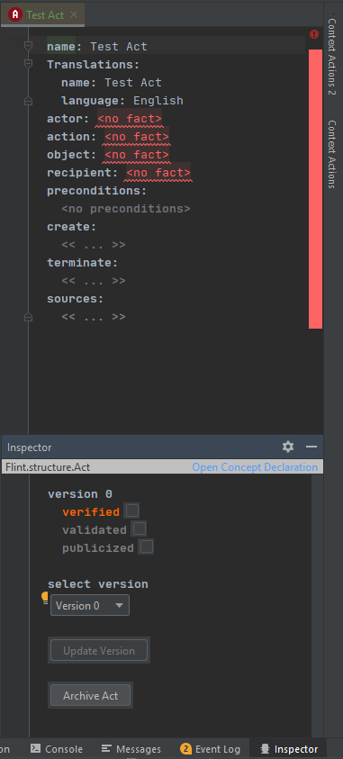
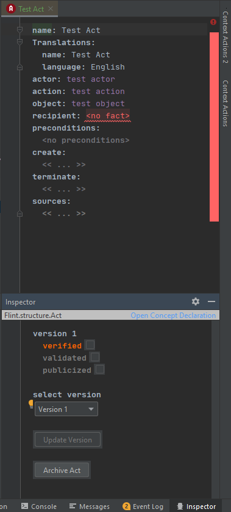
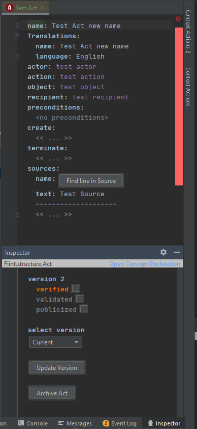

## Useful Shortcuts, Tips And Tricks
- `Ctrl+B` or `Ctrl+Click` will take you to the source of a reference.
- `Ctrl+F9` will rebuild the current solution.
- `Alt+Shift+7` or `Right Click > Find Usages` will allow you to see where a fact / act / duty or source is used.

- Most warnings have quick fixes hit `Alt+Enter` to see them.
- To see all errors / warnings in a model right click on the model and select check model.   
   
  You can also perform all quick fixed by hitting the `Perform Quick Fixes` button.   

- You can jump to any act/source/duty by hitting `Ctrl+N` and typing it's name.
