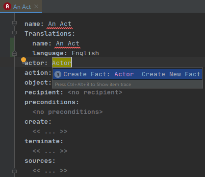
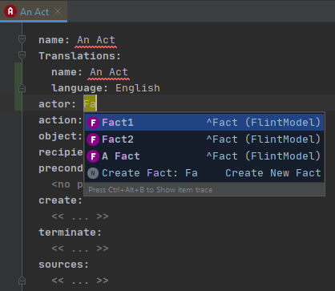
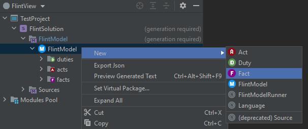
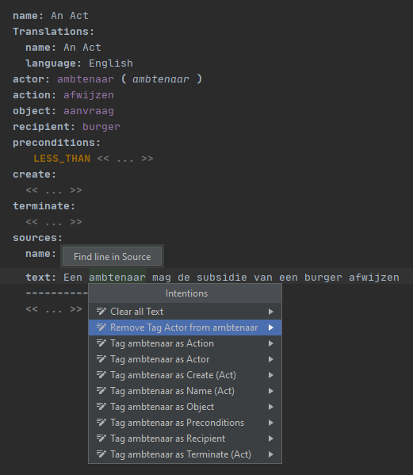
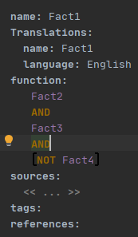
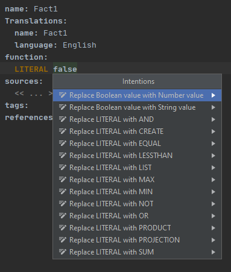
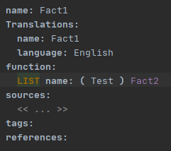
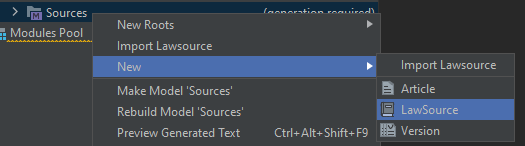

# Flint IDE User Guide  
This is the MPS Flint IDE user guide. The Guide covers the following topics.
- [Creating a Flint project](#creating-a-flint-project)
- [Import existing flint model](#optional-import-existing-flint-model)
- [Creating a Flint project](#creating-a-flint-project)
- [Editing a FlintModel](#editing-a-flintModel)
- [Creating a FlintRunner](#creating-a-flintrunner)
- [Useful Shortcuts, Tips And Tricks](#useful-shortcuts-tips-and-tricks)

## Creating a Flint project
1. Open MPS.
1. Click on Create new project.
1. Select Flint from the menu and fill in the project, solution and model names and hit OK.    

## [Optional] Import existing flint model
1. Right click on the solution folder solution and select "Import FlintModel from Json".  

1. Select the flint model json file and hit ok.
1. If the model folder says generation required. In the top bar click `Build > Make Project`. If you get a menu asking you to review errors select the `Ignore Errors` option.  

## [Optional] Import from Wetten.nl
1. Right click on the solution folder and select "Import FlintModel from Wetten.nl". 

1. Enter a juriconnect (for example jci1.3:c:BWBR0011823&hoofdstuk=3&afdeling=4&paragraaf=1&artikel=30b&lid=1&o=k&z=2019-02-27&g=2019-02-27
)  in the dialog and hit OK.

## [Optional] Use the FlintView
1. Left click on the "Logical View"
1. Select "FlintView" from the dropdown menu  

## Editing a FlintModel
1. Open the created FlintModel using the navigation menu.  

### Acts
1. To create an act right click on the acts or model folder and select Act.   

1. Replace the first <no name> with the name of the act.

#### Quick create new fact
1. Click on the area with <no fact> and enter the name of the fact.
1. Hit `Ctrl+Space` and select Create Fact: (factname).  

#### Select existing fact
1. Click on the area with <no name>.
1. Hit `Ctrl+Space`  and start typing the name of the fact until it's visible in the list.
1. Select the fact.   

#### Preconditions
See [expressions](#expressions).

#### Create & Terminate
For create and terminate you can select a fact or a duty the same way you [selected a fact](#select-existing-fact).

#### Act Sources
1. Create a source. See [sources](#sources).
1. To create a source reference click on the area with << ... >> and hit `Ctrl+Space` and select source or select the empty space under an existing source reference and hit `Enter`.  
1. Under name select the name of the source you would like to reference.
1. Under text enter the text from the source.

### Facts
1. To create a fact right click on the facts or model folder and select Fact.

1. Replace the first <no name> with the name of the fact.

#### Function
See [expressions](#expressions).

#### Fact Sources
1. Create a source. See [sources](#sources).
1. To create a source reference click on the area with << ... >> and hit `Ctrl+Space` and select source or select the empty space under an existing source reference and hit `Enter`.  
1. Under name select the name of the source you would like to reference.
1. Under text enter the text from the source.

### Source Tagging
1. Select the words you want to tag.
1. Hit `Alt+Enter`.
1. Select 'Tag as X'.

   
### Removing source tag
1. Select the words you want to untag.
1. Hit `Alt+Enter`.
1. Select 'Remove X tag'.

### Duties
1. To create a duties right click on the acts or model folder and select Duty.

1. Replace the first <no name> with the name of the duty.
1. You can create and select facts and acts just like in [acts](#acts)

### Sources
1. To create a source right click on the sources or model folder and select Source.

1. Replace the first <no name> with the name of the source.
1. Enter the juriconnect URI.
1. Enter the valid from and valid to dates. These can be entered manually in the dd-mm-yyyy format or by using the date picker by clicking the calendar icon.

You can open the juriconnect on wetten.nl by `Ctrl+Clicking` on the juriconnect.

### Expressions
There are different types of expressions. Creating these expressions with be explained below. To replace an expression hit `Alt+Enter` and select replace (expression x) with (expression y). To nest an expression hit `Alt+Enter` and select wrap (expression x) with new expression. 

### Explanation
You can add or remove an explanation from a act, duty, fact or source usage by hitting `Alt+Enter` and selecting Add or Remove Explanation`.

#### Fact reference
This is just a reference to a fact. You can [create](#create-new-fact) and [select](#select-existing-fact) these just like in acts and duties.
  

#### Multi expression
A multi expression has a list of expressions called operands. A multi expression cannot be converted to a single expression if it has more than one operand.
The following expressions are multi expressions:
- AND
- EQUAL 
- OR 
- MIN 
- MAX
- LESS_THAN
- SUM
- PRODUCT
- CREATE

To create a multi expression:
1. Hit `Ctrl+Space` and select the multi expression from the list.
1. Select the <no fact> area and input a operand which is also an expression.
1.  To add an extra operand you can use one of the following methods: 
    - To add an extra operand to the current multi expression select the expression's keyword (for example AND) and hit `Enter`.
    - To add an extra operand to the parent expression of the currently selected expression hit `Ctrl+Enter`.

#### Single expression 
A single expression has a single expression called operand. NOT is a single expression.

To create a single expression:
1. Hit `Ctrl+Space` and select a single expression from the list.
1. Select the <no name> area and enter the operand which is also an expression.

#### LITERAL expression
A LITERAL expression has a literal value called operand.
The value can be one of the following types:
- Boolean (true/false)
- String (text)
- Number  

To create a LITERAL expression:
1. Hit `Ctrl+Space` and select LITERAL from the list.
1. Select the <no value> area.
1. Hit `Ctrl+Space` and select the literal type.
1. Input the value.

To switch literal move the cursor to the literal value and hit `Alt+Enter` and select replace (type x) value with (type y).

#### LIST expression  
A LIST expression has a single expression called items and has a name property.
To create a LIST expression:
1. Hit `Ctrl+Space` and select LIST from the list.
1. Select the first <no name> area and enter the name of the list.
1. Select the second <no name> area and enter the items which is also an expression.

#### PROJECTION expression  
A PROJECTION expression has a reference to a fact with a CREATE expression called context and a reference to one of the operands of the CREATE expression that you want the value of called fact.
To create a PROJECTION expression:
1. Hit `Ctrl+Space` and select PROJECTION from the list.
1. Select the first <no fact> area, hit `Ctrl+Space` and select the CREATE expression fact.
1. Select the second <no fact> area, hit `Ctrl+Space` and select the operand of the CREATE expression that you want to project.

## Creating a FlintRunner
To create a FlintRunner:
1. right click on the flint folder with an `M` symbol and select `New > FlintModelRunner`.

1. Replace the first <no name> are with the name of the FlintRunner.
1. Select the area with <no flintModel>.
1. Hit `Ctrl+Space` and select the flint model you would like to run from the list.
1. Create actors as specified in [Actor](#actor).
1. Select the activeActors. These are the one or two actors the will be active by default in the runner menu.
1. Select the generalFacts. These are facts that apply to all actors.

To run the FlintModelRunner. 
1. Ensure the project has been built without errors. On the top bar select `Build > Make Project`.
1. Right click somewhere in the FlintModelRunner and select `Run FlintModel` from the list. A Window will open up on the right side where you can test your flint model.

### Actor
1. Create an actor by selecting the <<...>> area under actors:, hitting `Ctrl+Space` and selecting actor.

1. Under facts: you specify the facts that apply to this actor.

## Law Texts
You can import a law text to simplify making flint models.

### Importing
To import a law text:
1. Select a parser from the Publication Parser Selector panel.   

2. `Right Click` the model and create a new `LawSource`.     

3. Input the BWB code for the law text you wish to import.   

4. Click the `Refresh` button. The name of the law text and the available versions will be loaded in.

5. You can navigate to one of the version with `Ctrl+Click`.

6. Hit the `Refresh` button to load in the articles or hit the `FlintFiller` button to run the flint filler for this version.
    - You can navigate to an article with `Ctrl+Click`.
    
### Create Act/Duty/Fact From Law Text
To create an act from law text:
1. Select the model you would like to create the Act/Duty/Fact in from the Current Model Selector panel.    

2. Select the text that your act is in.
3. Hit `Alt+Enter` or `Right Click > Article Actions` and select `Create {Act/Duty/Fact} from Selected Text`.

### Splitting a LawText sentence. 
To split a sentence:
1. Place the cursor where you would like to split the sentence. 
2. Hit `Alt+Enter` and select `Split Line`.   
 
You can also select `Add Text to Existing Node` to add the source to an existing Act/Duty/Fact.
## Useful Shortcuts, Tips And Tricks
- `Ctrl+B` or `Ctrl+Click` will take you to the source of a reference.
- `Ctrl+F9` will rebuild the current solution.
- `Alt+Shift+7` or `Right Click > Find Usages` will allow you to see where a fact / act / duty or source is used.

- Most warnings have quick fixes hit `Alt+Enter` to see them.
- To see all errors / warnings in a model right click on the model and select check model.   
   
  You can also perform all quick fixed by hitting the `Perform Quick Fixes` button.   

- You can jump to any act/source/duty by hitting `Ctrl+N` and typing it's name.
